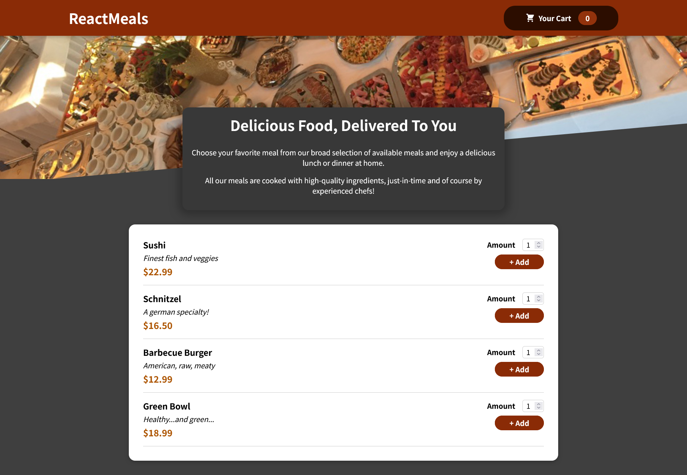

# React Meals.

A React food application that lets the user make an order and check the cart.

## Table of contents

- [Overview](#overview)
- [The project - Features](#the-project)
- [Screenshots](#screenshots)
- [Links](#links)
- [My process](#my-process)
- [Built with](#built-with)
- [What I learned](#what-i-learned)
- [If I had more time I would change this](#if-i-had-more-time-i-would-change-this)
- [Continued development](#continued-development)
- [Author](#author)

## Overview

### The project

Users should be able to:

- Add one or more meals to the cart.
- Remove a whole meal or just one item from the cart.
- See the updated total amount of the order.
- Receive a 'Thank you' message after order is finalized.
- View the optimal layout depending on their device's screen size.
- See hover and animated states for interactive elements.

### Screenshots

### Links

- Live Site URL: [React Meals App Live](https://reactdummymeals.netlify.app/)

## My process

### Built with

- [React](https://reactjs.org/) - JavaScript library
- [Create React App](https://create-react-app.dev/) - React environment
- [CSS Modules](https://github.com/css-modules/css-modules) - For Styles
- [JavaScript](https://developer.mozilla.org/en-US/docs/Web/JavaScript) - Frontend language
- [Semantic HTML5 markup](https://www.w3.org/html/) - For the web structure

### What I learned

- This project was very important for cementing some key React hooks and tools: Context API, useReducer, Portals and useRef. I've learned and understood the difference between them, the use cases, the do's and do not's, etc.
- Not least important, I got to review the React basics I already knew: useState, useEffect hooks, conditional rendering of lists, styling React components, forms, Fragments, managing side effects, among others.

### If I had more time I would change this

- Even though the goal of the app was to get more comfortable with managing State with Context and Reducer, if I had more time I would add a more sophisticated logic behind the 'Order' meal button, so that something fancier happens after the user order the meals they want.

### Continued development

- I've already finished a Jest and React Testing Library course, so I decided to embark on an thorough React course, which is the second course on React I do. After I finish with React I will go for TypeScript.

## Author

Jorge Enrique Echeverría.
